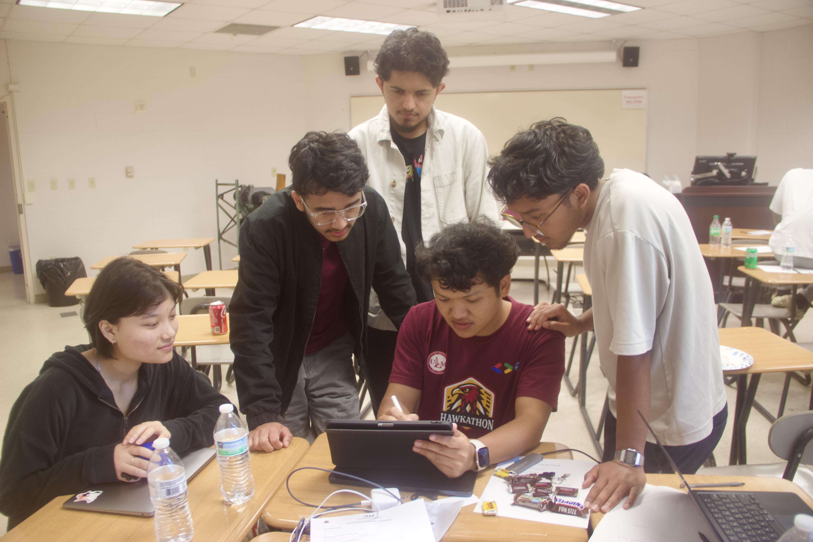
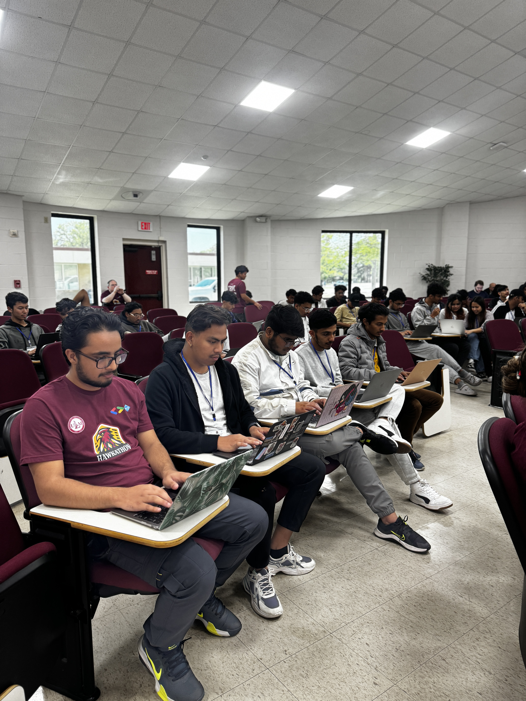

On April 12-13, 2024, the [Google Developer Student Clubs (GDSC)](https://www.instagram.com/gdsc_ulm/) at the [University of Louisiana Monroe (ULM)](https://ulm.edu) proudly hosted ULM's first ever Hackathon. This event marked a significant milestone in ULM’s commitment to innovation and creativity, bringing together a diverse group of students to tackle real-world challenges.

---

## Event Highlights

### Innovation and Collaboration

With over 60 participants, the Hackathon was buzzing with ideas and energy. Teams worked around the clock, developing everything from console apps to sophisticated web applications. These projects not only showcased the participants' technical skills but also their dedication to solving practical problems faced by the ULM community.

### My Project: ClassCraft

I had the opportunity to present my demo project, **ClassCraft**, a web application designed to enhance class scheduling with a built-in feedback system. This tool aims to streamline the academic experience at ULM, making it more accessible and responsive to student needs.

### Mentoring and Inspiration

As a mentor, it was exhilarating to guide the participants through the brainstorming and development processes. The palpable enthusiasm and collective effort to bring innovative ideas to life were truly inspiring. It was a pleasure to see students from various disciplines coming together, eager to learn and push the boundaries of what they can create.

## Looking Forward

The success of this Hackathon has set a precedent for future events. We are excited about the prospect of making the ULM GDSC Hackathon an annual tradition, continually fostering a culture of innovation and creativity among students. The feedback from the judges and participants was overwhelmingly positive, underscoring the importance of such events in nurturing future innovators and problem solvers.

## Conclusion

We extend our heartfelt thanks to all the professors, sponsors, and participants who made this event a resounding success. Your passion and commitment to excellence have laid the foundation for a vibrant tech community at ULM.

Stay tuned for more updates, and we hope to see even greater participation in the years to come!

_Organized by: Google Developer Student Clubs at ULM_

## Photo Gallery

_Presenting my project, ClassCraft, at the ULM GDSC Hackathon_

_Mentoring participants during the Hackathon_

_Participants engaged in a typing competition_

_GDSC ULM team after a successful Hackathon_

## ULM GDSC Hackathon 2024

Learn more about the event:

- [GDSC ULM Instagram: https://www.instagram.com/](https://www.instagram.com/gdsc_ulm/)
- [Demo Link: https://class-craft.vercel.app/](https://class-craft.vercel.app/)
- [GitHub Repository: https://github.com/dineshchhantyal/ClassCraft](https://github.com/dineshchhantyal/ClassCraft)
- [My Presentation: https://slides.com/d/2PQgDwk/live](https://slides.com/d/2PQgDwk/live)
- [Barnstorming: Word](https://ulmwarhawks-my.sharepoint.com/:w:/g/personal/chhantyald_warhawks_ulm_edu/EUVpUoHJyr9DrNVRoDyeLnABomBS56oXzoGYczoxaULpkQ?e=dTkoyX)
