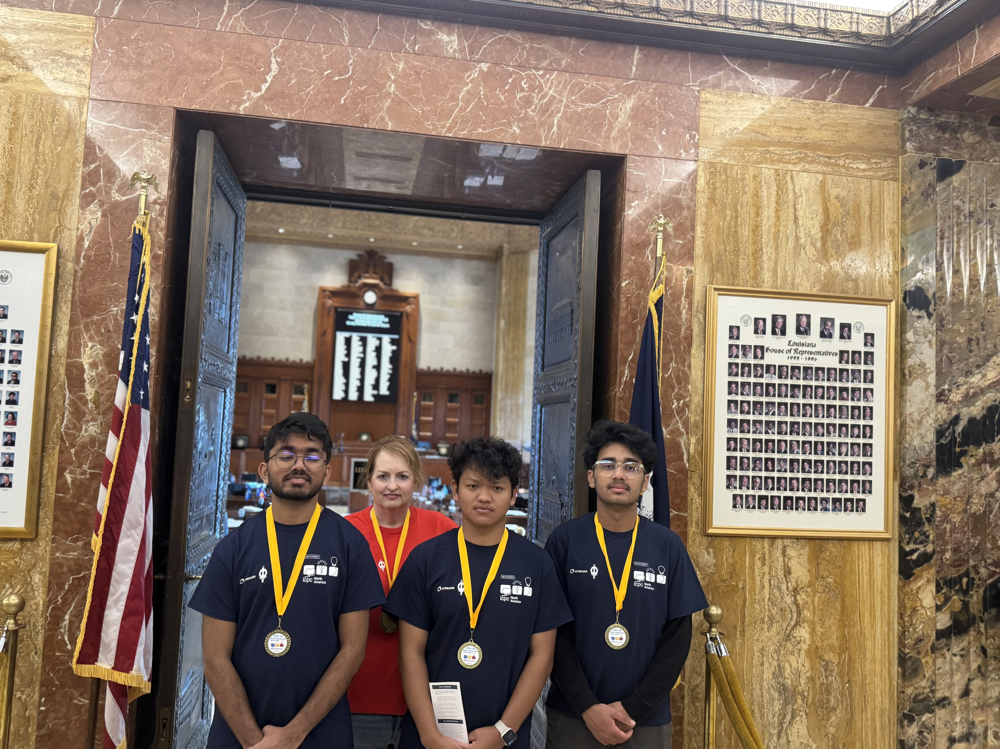
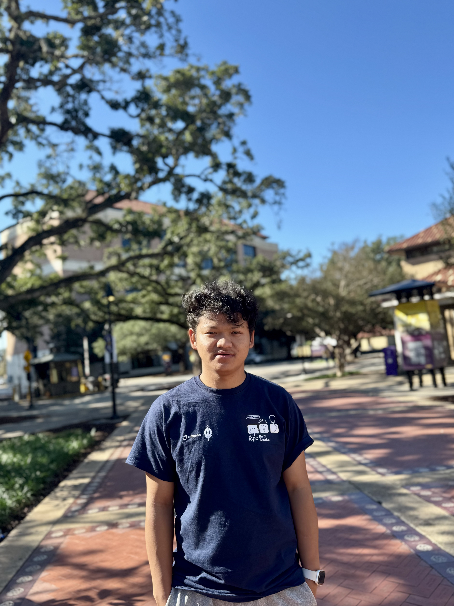
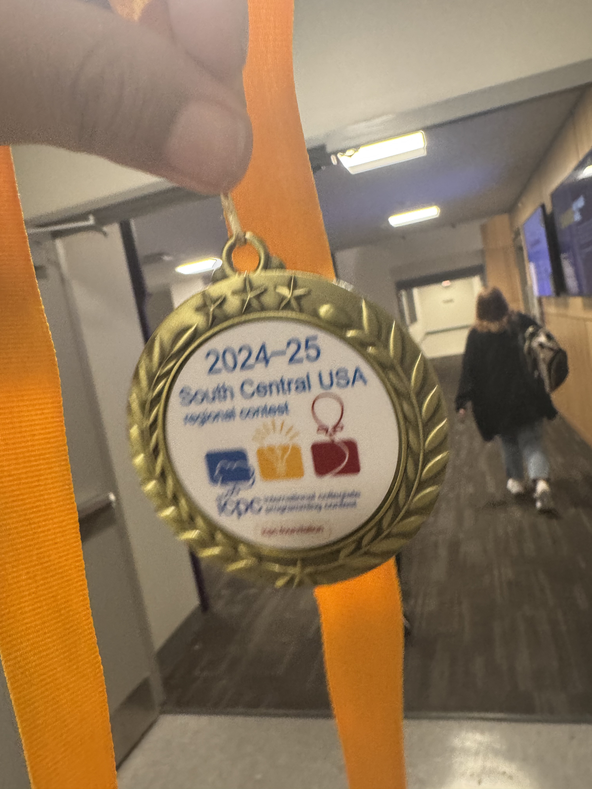

## A Day to Remember – ICPC NA South Division 2024

On **November 2024**, our team participated in the **ICPC NA South Division 2024 – Division 1** at LSU Baton Rouge. This prestigious contest challenged us with a rigorous **5-hour competitive programming session** where we tackled complex problems on Kattis, showcasing skills in problem-solving, algorithms, and teamwork.

### 🥇 **State Champions**

I am beyond thrilled to announce that **our team (Biswash, Predeep, and I)** secured the **State Champion title**, earning a **gold medal**! This achievement reflects not only our hard work but also the incredible mentorship we received.

---

### Gratitude & Acknowledgments

A heartfelt thanks to **Dr. Prasanthi Sreekumari** for encouraging us to participate in this renowned competition.
Special appreciation to our coach, **Kim Taylor**, whose dedicated guidance—from honing our coding techniques to preparing us for the contest—was instrumental in this success.

---

### Capturing the Moment

- **Group Picture**: Our proud team after the competition.
- **Solo Picture**: A moment to cherish this personal milestone.
- **Medal Picture**: Celebrating the victory with the gold medal!

---

### What is ICPC?

The **International Collegiate Programming Contest (ICPC)** is one of the most prestigious competitive programming contests worldwide, where university students solve algorithmic challenges under time pressure. It’s a testament to skill, teamwork, and perseverance.

### Looking Ahead 🚀

This success fuels our passion for competitive programming and motivates us to aim for even greater milestones in future contests.

#ICPC #CompetitiveProgramming #CodingContest #StateChampion #GoldMedal #Teamwork #ULM #LSU #Programming
