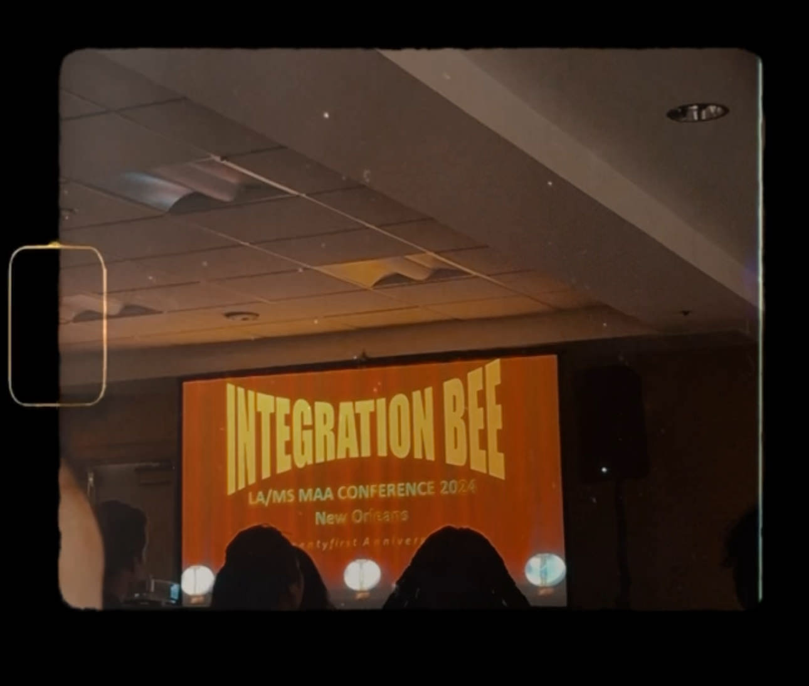
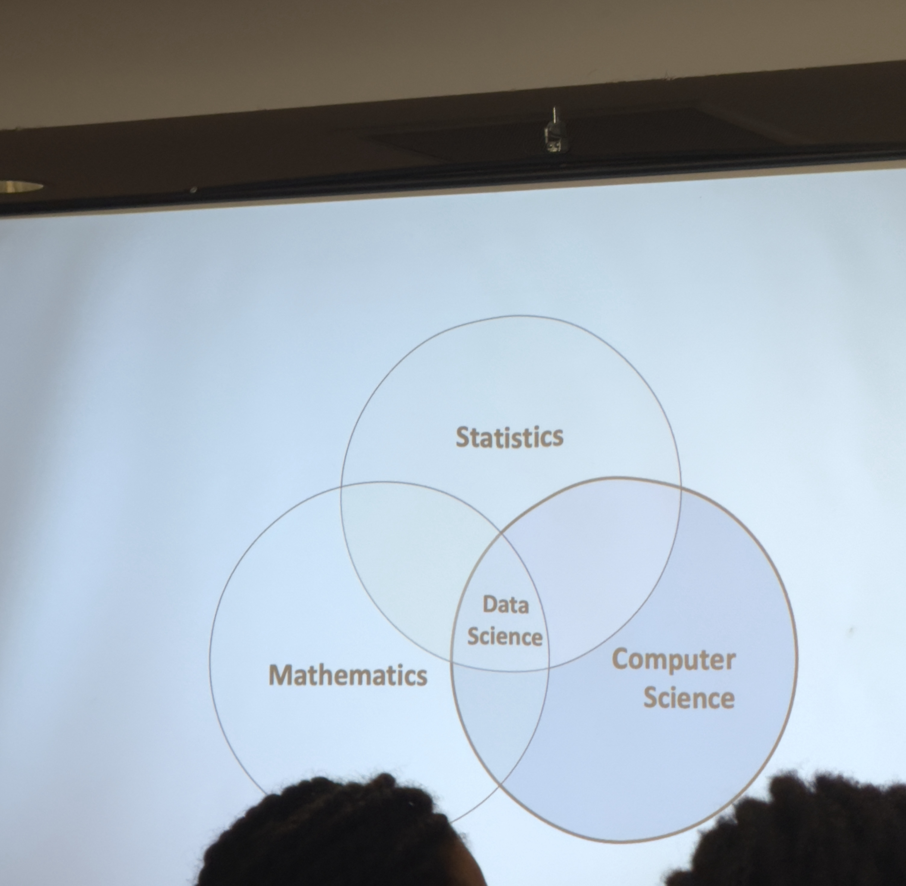
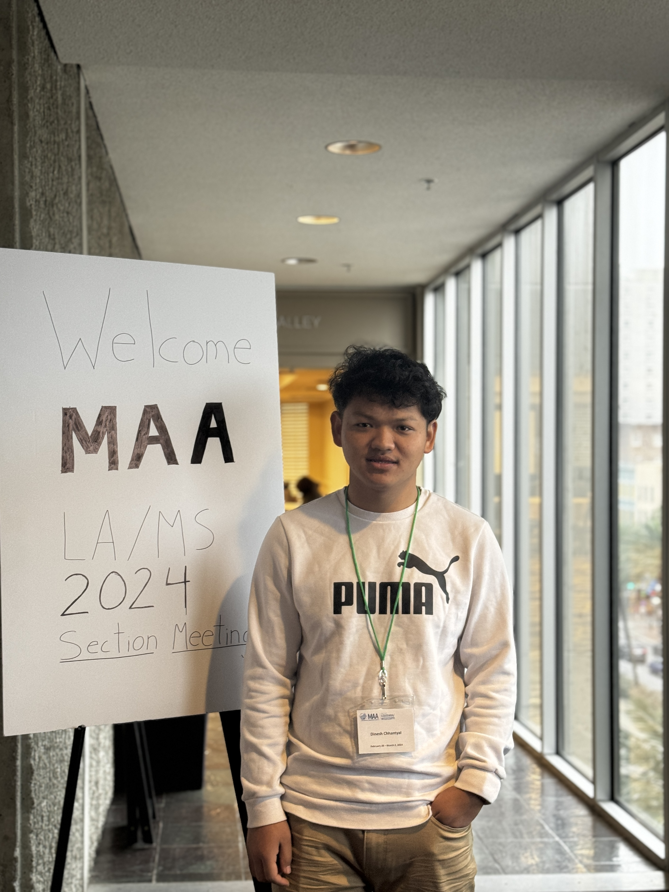
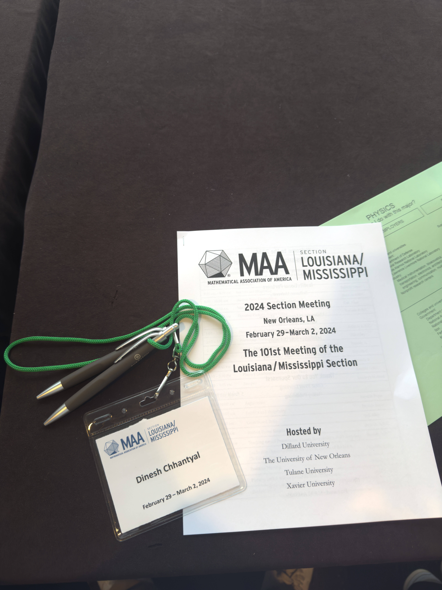
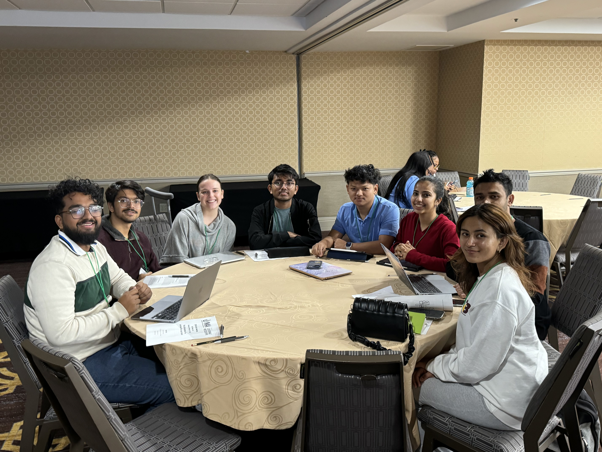
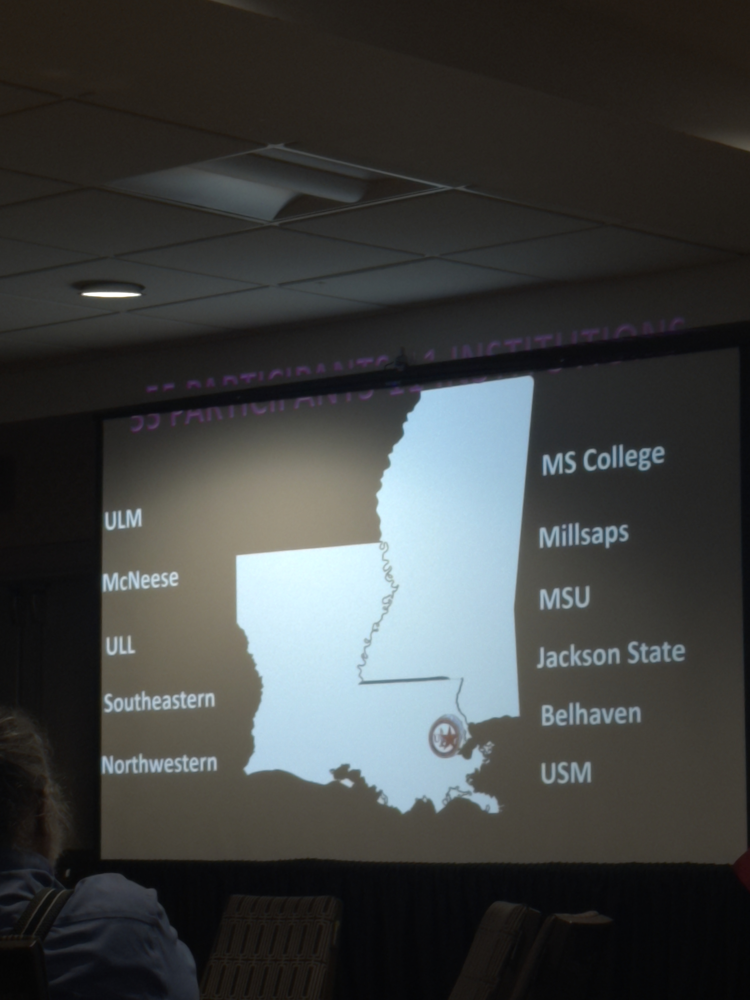
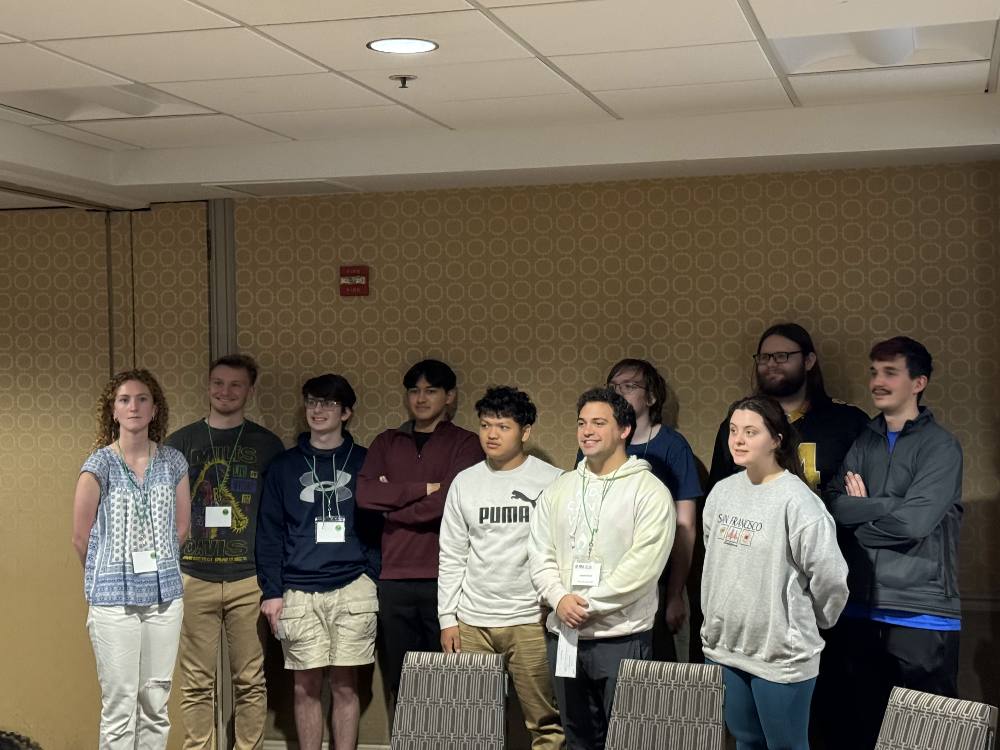
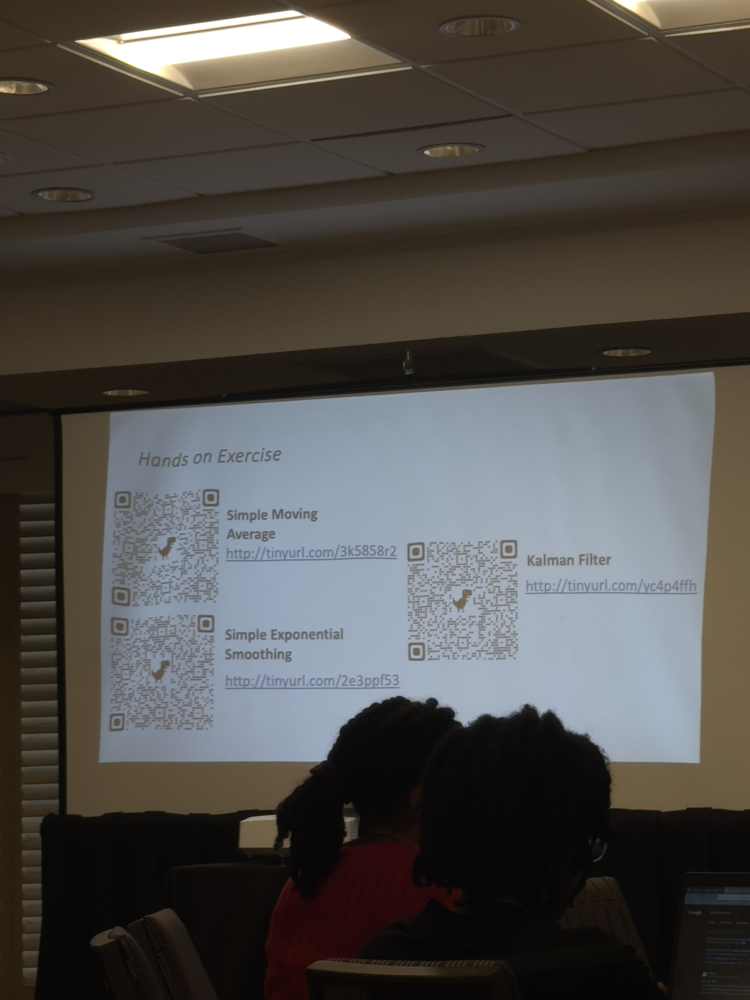

The [Mathematical Association of America][https://www.la-ms.maa.org/] (MAA) Louisiana/Mississippi Section Meeting 2024 was a celebration of mathematical inquiry and discovery. From the Integration Bee to insightful workshops, the conference was a convergence of minds and ideas. The event was held at the Sheraton Hotel in [New Orleans, LA](https://maps.app.goo.gl/2EYHBAYsDL1gy82o7), from February 29 to March 2, 2024.

---

Last week, the mathematical community witnessed a convergence of minds and ideas at the MAA Louisiana/Mississippi Section Meeting, hosted in the beautiful and bustling city of New Orleans, LA. The event, which ran from February 29 to March 2, 2024, at the Sheraton Hotel, was a spectacular blend of competition, collaboration, and learning, hosted by Dillard University, The University of New Orleans, Tulane University, and Xavier University.

## A Competition Like No Other: The Integration Bee

A personal highlight for me was participating in the Integration Bee competition, where I proudly secured the third position among 55 competitors from 12 different universities. But this wasn't just any competition; it was presented with a unique wedding theme, making it not only a test of mathematical prowess but also a celebration of unity and love for the subject. Competing in such a creative and vibrant environment was both challenging and exhilarating, and standing on the podium was an honor I’ll always cherish.

## Workshops that Broadened My Horizon

The conference was rich with workshops that were insightful and forward-thinking, aligning closely with current trends in the mathematical sciences and their applications. I had the privilege of attending several workshops that stood out for their depth and practical implications.

### Mathematical Models in Data Science

This workshop, led by experts from Louisiana Tech University, delved into the significance of mathematical models in data science applications, such as Indoor Location Tracking Systems (ILTS). It underscored the challenges posed by noisy, non-Gaussian data and the limitations of the path loss model. From a computer science perspective, understanding the intricacies of these models is crucial for developing algorithms that can efficiently process and analyze data, enhancing the accuracy of technologies like iBeacon for real-world applications. I'm really excited about the implementation of this technology in the near future.

### Mathematical Modeling Comes Alive

This hands-on workshop, led by Ricardo Cortez and Cynthia Anhalt, with modeling experts Hongfei Chen and Adnan Morshed from Tulane University, provided a dynamic exploration of the mathematical modeling process across different levels of expertise. It was enlightening to see the thought process of both novice and expert modelers and discuss the implications for teaching mathematical modeling from primary education to post-secondary levels.

#### The Bowling Game Model

The selection of a bowling game for mathematical modeling was both innovative and insightful. It allowed us to delve into the physics of the sport—considering aspects like momentum, friction, and kinetic energy—and translate these into computational models. This process emphasized the essential synergy between physics, mathematics, and computer science, showcasing how physical phenomena can be abstracted into mathematical formulations and then simulated computationally.

### What Do I Do Next? Careers in the Mathematical Sciences

Moderated by Catherine Putnam with panelists from diverse fields such as the NSA, Mississippi State University, Southern Farm Bureau Life Insurance, and the University of Louisiana Lafayette, this session was a treasure trove of insights into the myriad career paths available for mathematics majors. The panelists shared their experiences and advice, opening up a dialogue about the vast opportunities in academia, government, and industry for those with a passion for mathematics.

## Concluding Thoughts

The MAA Louisiana/Mississippi Section Meeting 2024 was more than just a conference; it was a celebration of mathematical inquiry and discovery. From achieving a personal milestone in the Integration Bee to absorbing invaluable knowledge from experts in the field, the experience was both enriching and inspiring.

As I reflect on the conference, I am reminded of the vibrant community that mathematics nurtures and the endless possibilities it presents for exploration, innovation, and career development. Also, I want to express my sincere gratitude to Professor Dr. Shim, Dr. Farman, and the [University of Louisiana at Monroe](ulm.edu) for giving me the opportunity to attend the MAA Louisiana/Mississippi Section Meeting in New Orleans. It was an experience that has left an indelible mark on my journey. I look forward to the next edition of this conference and the new horizons it will unveil.

## Image Gallery

- Me at the conference

- My name tag for the conference

<!--  -->

- ULM team at the conference

- All university participants in the Integration Bee

- Winners of the mathematics competition: Team and Individual

- Data Science and Math Modeling Workshop

[https://www.la-ms.maa.org/]: https://www.la-ms.maa.org/
