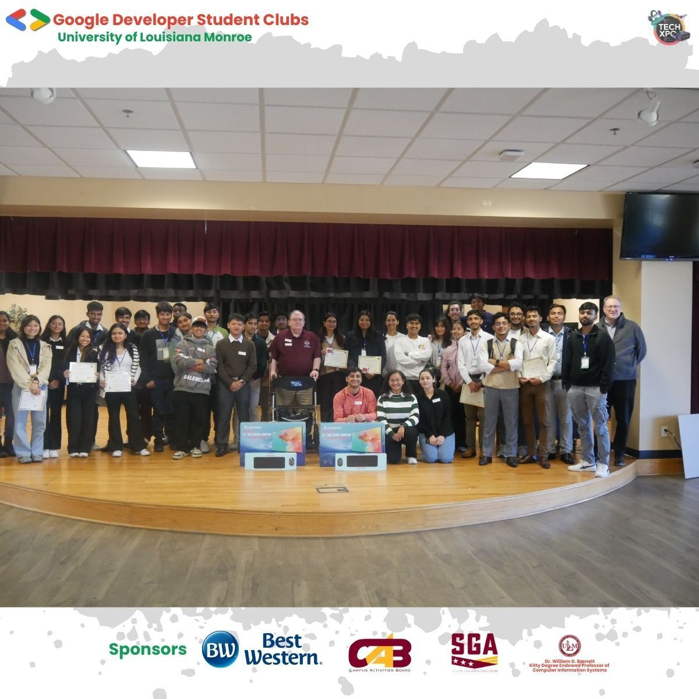
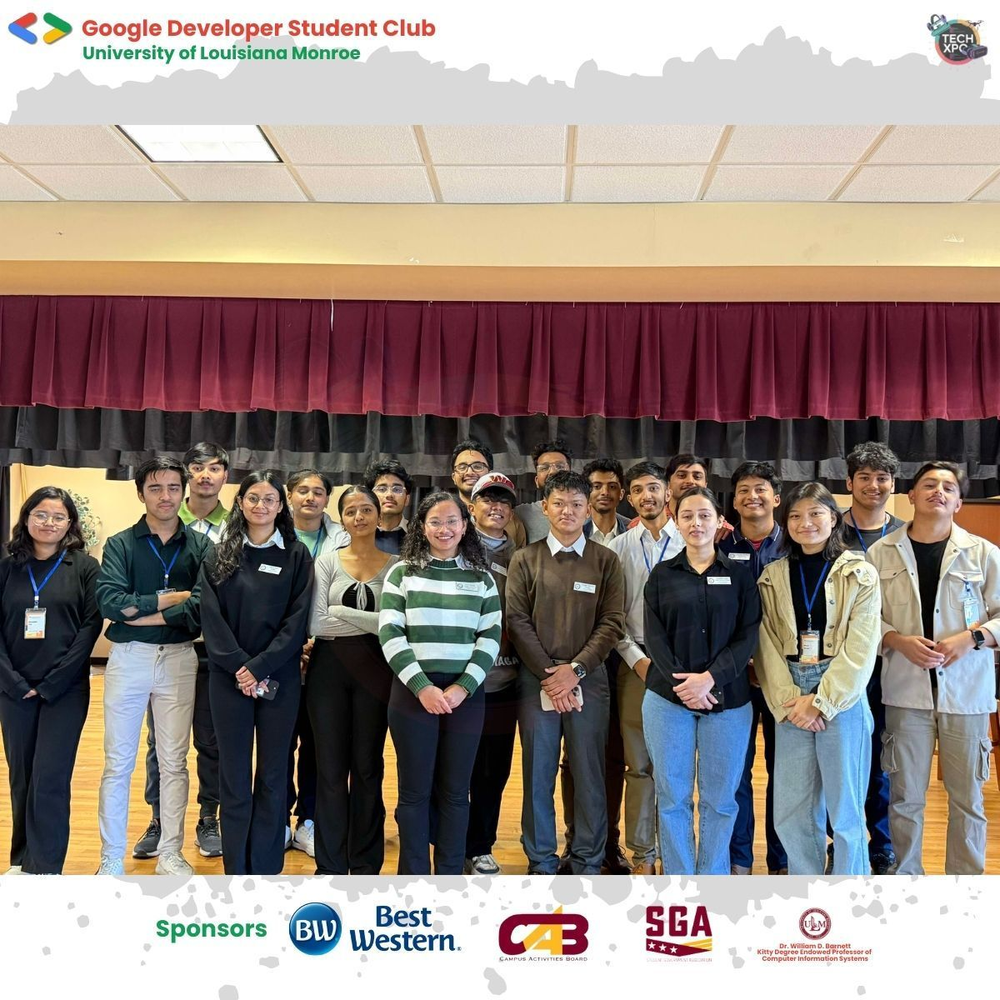
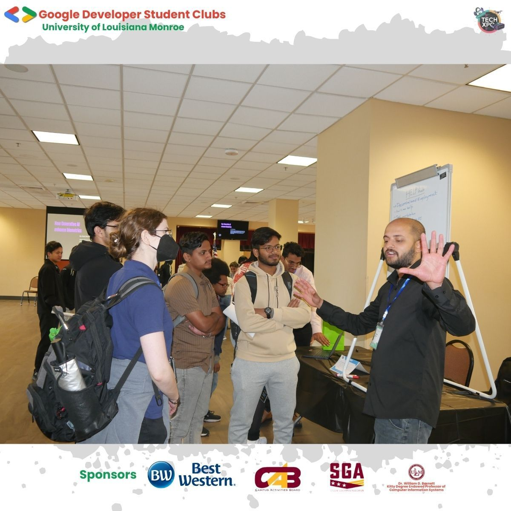
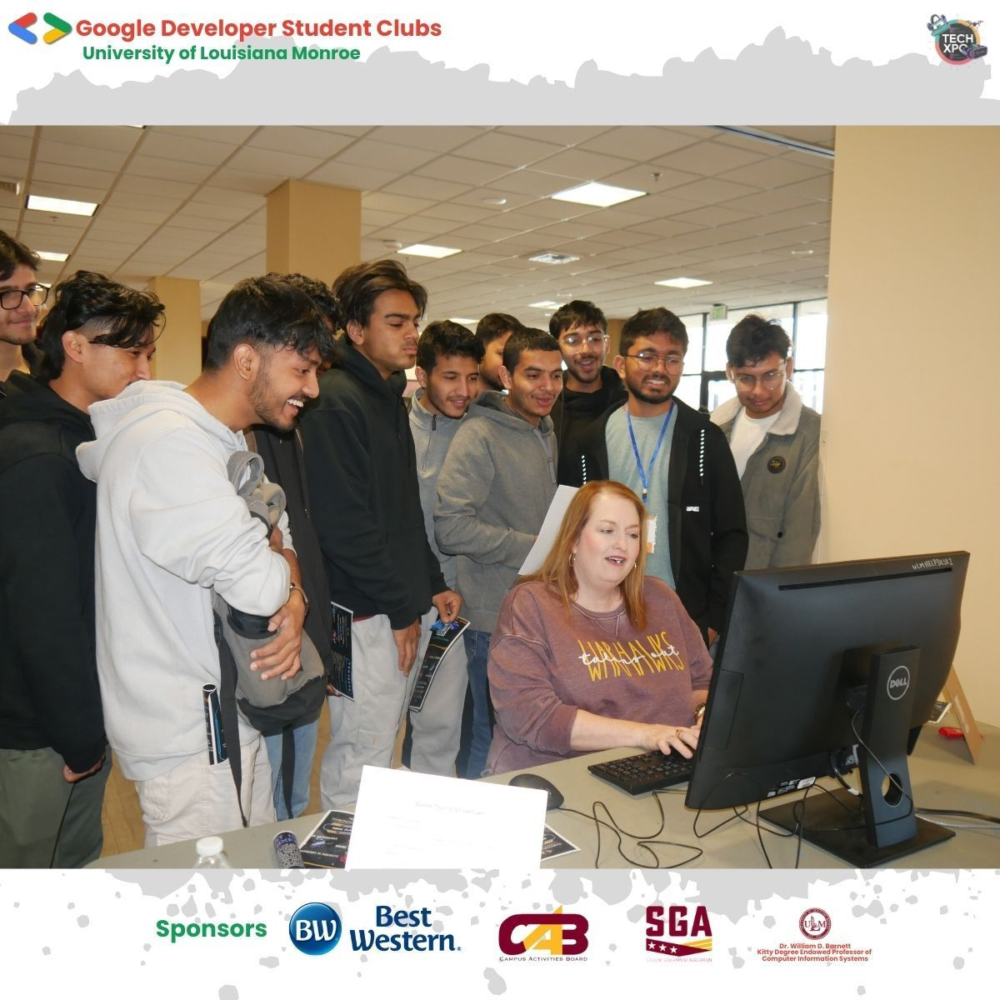
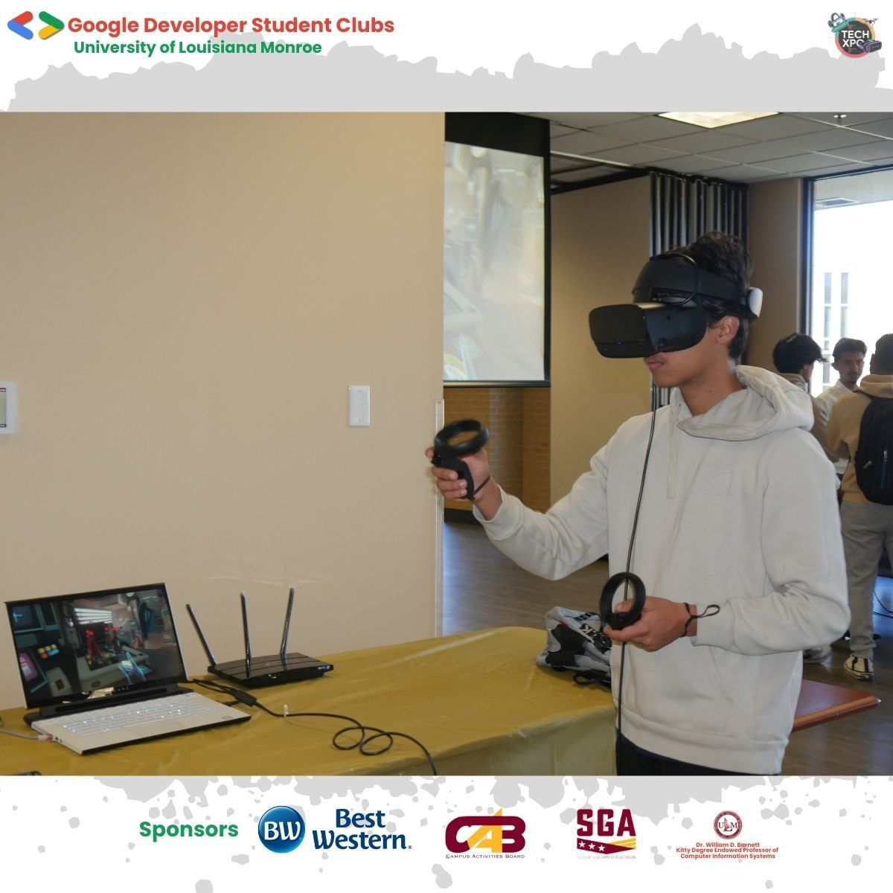

As the President of **GDSC at ULM**, I’ve always envisioned creating a platform that celebrates **technology and innovation** in a festive and inspiring way. On **November 22, 2024**, this vision became a reality with the launch of the first-ever **TechXpo ULM**.

### The Vision

When I first imagined TechXpo, I wanted it to be more than just an event—I wanted it to be a **movement** that inspires people, brings together creative minds, and fosters collaboration. My goal was to build a space where students and professionals alike could showcase their innovative ideas, connect with one another, and spark meaningful conversations about the future of technology.

### The Journey

The journey from idea to execution was both **challenging and rewarding**. It began months ago with brainstorming sessions, countless meetings, and meticulous planning. I worked closely with a talented team of **12 board members**, whose ideas and enthusiasm turned my abstract vision into actionable steps.

We also relied on the support of **15 dedicated volunteers**, who worked tirelessly to ensure every detail was in place. Their effort, coupled with the guidance of our **professors and advisors**, gave us the confidence to push boundaries and aim high.

### The Day of TechXpo

When the big day finally arrived, it was nothing short of magical. The event featured **28 incredible projects**, each a testament to the creativity and hard work of our participants. From innovative apps to groundbreaking prototypes, the projects truly embodied the spirit of innovation.

What made it even more special was the overwhelming support from the community. We welcomed over **200+ visitors**, whose presence and engagement turned TechXpo into a lively and collaborative experience.

### Highlights and Gratitude

Looking back, some of the highlights that stood out to me included:

- Seeing participants confidently present their ideas to judges and visitors.
- Watching visitors engage with projects, ask thoughtful questions, and offer encouragement.
- Hearing the feedback from professors and advisors, who expressed pride in what we accomplished together.

I cannot thank enough the **participants**, **volunteers**, **judges**, **professors**, **advisors**, and **supporters** who made this event possible. Your contributions were the **heart and soul** of TechXpo.

### More About TechXpo

For detailed information about the projects, organization, and behind-the-scenes planning of TechXpo, you can visit the official GitHub repository:
👉 [TechXpo GitHub Repository](https://github.com/GDSC-ULM/TechXpo/blob/main/README.md)

### A Celebration of Community

TechXpo wasn’t just about technology—it was about **people**. It reminded me that innovation thrives when we come together as a community to share knowledge, encourage creativity, and celebrate achievements.

### What’s Next?

While the first TechXpo has concluded, this is just the **beginning**. My hope is to see this event grow in scale and impact, continuing to inspire students and professionals alike in the years to come.

To everyone who was part of this journey—thank you. Let’s keep building, dreaming, and innovating together.

